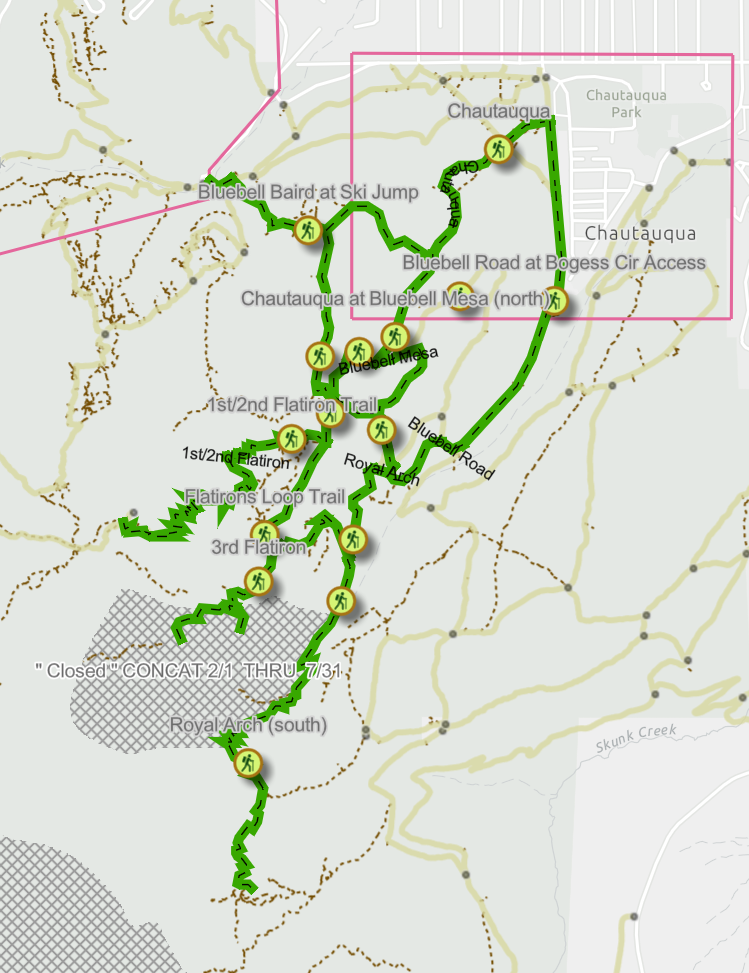

# Eco Map - MAD Zonal Analysis

## Overview

This guide documents the process for extracting zonal statistics of Eco Map ratings by Management Designation Area.

## Create Project

Create a new ArcGIS Pro project. This will also create a project GDB that we can export copies of feature layers to for local manipulation and more stable analysis.

## Add feature layers

Add the following feature layers to the map

-   Management Area Designations - In House.lyrx

    -   E:\Layers\Planning\Management Area Designations - In House.lyrx

-   EcoMap2024

    -   E:\MapFiles\ScienceOffice\Projects\\2024_EcoMap\EcoMap2024\\EcoMap2024.gdb\EcoMap2024

**Export MADs to local GDB**

Export the `Management Area Designations - In House` to the local ArcGIS Pro project's GDB. Name `ManagementAreaDesignation_InHouse`

Remove the original layer, keeping only the local copy. Although the symbol in the table of contents shows MADs by Active/Inactive status, this is only being applied at the visual level. To run zonal statistics we need to calculate a field that combines both the `ManagementArea` and `Active` fields. However, the `Active` field is a coded domain of `0 = No` and `1 = Yes` . To concatenate the string domain labels with the `ManagementArea` status we need to extract the domain labels as a temporary variable before concatenating. In the attribute table, right click on any field and select Calculate Field. Set the desired name for the new field `Management Area by Status` and paste the following Arcade code into the code field.

```arcade
var status = Decode(
    $feature.Active,
    1, ' - Active',
    0, ' - Inactive',
    ''
)

Concatenate($feature.ManagementArea, status)
```

## Run Zonal Statistics as Table

Now that we have the combined `Management Area by Status` field, run the Zonal Statistics as


